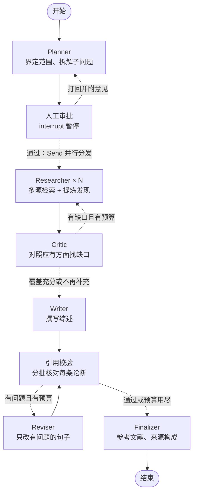

# ScholarGraph

基于 LangGraph 的多智能体学术文献调研系统：输入一个研究问题，输出一份**每句论断都可追溯到论文**的综述报告。

## 工作流



## 设计要点

| 要点 | 做法 | 代码位置 |
|---|---|---|
| 并行检索 | 用 `Send` 为每个子问题启动一个 Researcher（map-reduce），结果由 reducer 合并 | `routing.py`、`state.py` |
| 人在回路 | `interrupt()` 暂停等待审批，可通过，也可附意见打回重新规划 | `nodes/human_review.py` |
| 断点续跑 | 每一步的状态写入 SQLite checkpoint，进程重启后可用 `--resume` 继续 | `checkpoint.py` |
| 回环必然终止 | 检索轮数、修订次数的预算由代码强制执行，不依赖模型自觉 | `nodes/critic.py`、`nodes/verifier.py` |
| 多源联邦检索 | 同一个检索词同时发给 arXiv 和 OpenAlex（可选 Semantic Scholar），避免文献全部来自一个来源 | `search/federated.py` |
| 结果融合 | 按 ID、DOI、标题识别同一篇论文并合并字段；用 RRF（倒数排名融合）跨来源、跨检索词排序 | `search/fusion.py` |
| 单源故障不拖垮运行 | 某个来源失败时用其余来源的结果；连续失败 2 次即熔断，不再白等超时 | `search/federated.py` |
| 影响力信号 | OpenAlex 提供被引次数和发表出处，展示给 Researcher 和 Writer，用于挑选代表性工作 | `prompts.py` |
| 证据强度 | 发表满一年仍被引 0 次、学位论文、DOI 来自 Zenodo 等自存档平台的论文标为"弱证据"：候选排序后移，概述和概括性的句子不能只靠它们支撑（代码检出） | `quality.py`、`nodes/verifier.py` |
| 主要结论 | Researcher 为每篇采用的论文记下主要结论，Writer 据此引用，避免只引用代表作的次要结果 | `nodes/researcher.py` |
| 范围约束 | Planner 先界定调研范围（研究对象、不包括什么），经人工审批后约束后续所有智能体 | `nodes/planner.py` |
| 补充检索不走回头路 | Critic 先列出应覆盖的方面再找缺口；用过的检索词由代码过滤，不会重复检索 | `queries.py`、`nodes/critic.py` |
| 证据池约束 | Writer 只能引用证据池里的论文 ID；虚构引用由正则 + 集合运算**确定性检出** | `citations.py`、`nodes/verifier.py` |
| 引用语义校验 | 分批让 LLM 判断论断是否被摘要支撑、研究对象是否在调研范围内；模型漏判的再问一次，仍无结果的如实标为"未能校验"，不算通过 | `nodes/verifier.py` |
| 逐句修订 | 模型只给出"这一句改成什么"，替换由代码完成；其余句子一字不变，已通过的校验结论继续有效 | `nodes/reviser.py` |
| 可靠的结构化输出 | JSON 模式 + Pydantic 校验，失败时带着错误信息重问 | `llm.py` |
| 可观测、可评测 | 进度里显示检索与校验统计；每次运行另存一份指标 JSON，供评测阶段直接取数 | `session.py`、`metrics.py` |
| 可离线测试 | LLM 和检索器都是协议（Protocol），测试时注入假实现，不联网、不花钱 | `tests/` |

## 快速开始（Windows）

需要 Python 3.10 及以上。在 PowerShell 或 CMD 中进入项目文件夹后执行：

```powershell
python -m venv .venv
.venv\Scripts\activate
pip install -e ".[dev]"
copy .env.example .env
```

国内网络安装较慢时，可以在 `pip install` 后面加上 `-i https://pypi.tuna.tsinghua.edu.cn/simple`。

然后用记事本打开 `.env`，把 `LLM_API_KEY` 改成你自己的密钥。`.env` 已被 `.gitignore` 忽略，不会被提交到 Git。

先跑一遍离线测试，确认环境没问题（不联网、不消耗 token）：

```powershell
pytest
```

再做一次真实调研：

```powershell
python -m scholargraph "大语言模型幻觉问题有哪些主流缓解方法？"
```

程序会先展示调研范围和计划并暂停：直接回车表示通过；输入文字则作为修改意见退回给 Planner
（例如"范围里也要包括多模态模型"）。

运行结束后在 `outputs/` 下得到两个文件：

- `会话ID.md`：综述报告，末尾附参考文献、文献来源构成和引用校验说明。
- `会话ID.metrics.json`：这次运行的指标（检索、校验、token、耗时）。

一次调研通常需要几分钟，时间主要花在文献检索上：arXiv 要求两次请求至少间隔 3 秒，
所以检索请求是排队执行的。想快一些可以把 `.env` 里的 `MAX_QUERIES_PER_SUB_QUESTION` 调小。

其他用法：

```powershell
python -m scholargraph "你的问题" --auto-approve     # 跳过人工审批
python -m scholargraph --resume 20261005-213000      # 从断点继续一次中断的调研
```

## 文献检索源

| 来源 | 特点 | 是否需要密钥 | 默认 |
|---|---|---|---|
| arXiv | 预印本，更新最快；没有被引次数 | 不需要 | 启用 |
| OpenAlex | 期刊、会议论文和预印本；有被引次数和发表出处 | 不需要，但建议免费注册一个 | 启用 |
| Semantic Scholar | 覆盖面类似 OpenAlex | 不需要，但不带密钥时容易被限流 | 不启用 |

用 `.env` 里的 `SEARCH_SOURCES` 选择来源，例如 `SEARCH_SOURCES=arxiv,openalex,semantic_scholar`。

arXiv 几乎只收录计算机、物理、数学等方向。医学、营养学等题目用 `SEARCH_SOURCES=openalex` 即可，
可以省下约一分钟的排队检索。如果某个来源返回了论文、却一篇都没被最终引用，运行结束时终端会给出提示。

关于 OpenAlex 的额度（2026 年 10 月的官方说明，以官网为准）：不带密钥每天有少量免费额度，
按每次检索的计价大约够检索 100 次，也就是跑几次调研；在 <https://openalex.org/settings/api>
免费注册密钥并填入 `OPENALEX_API_KEY` 后，额度是原来的 10 倍。额度用完时 OpenAlex 会返回
HTTP 429，程序会自动停用这个来源、只用其余来源继续，并在终端里说明；
如果最终引用的论文因此全部来自同一个来源，报告的"文献来源构成"一节也会明确提示。

每次运行结束时，终端会逐个来源报告请求次数、失败次数和返回的论文数。

## 目录结构

```
ScholarGraph/
├─ src/scholargraph/
│  ├─ graph.py          # 组装工作流图（先读这个文件）
│  ├─ state.py          # 图的状态与 reducer
│  ├─ routing.py        # 条件边
│  ├─ nodes/            # 八个节点，每个节点一个文件
│  ├─ schemas.py        # 数据模型（Pydantic）
│  ├─ prompts.py        # 全部提示词
│  ├─ citations.py      # 论文 ID 与引用解析（纯函数）
│  ├─ queries.py        # 检索词清洗（纯函数）
│  ├─ quality.py        # 发表状态与证据强度（纯函数）
│  ├─ llm.py            # 大模型访问层
│  ├─ search/           # 文献检索层
│  │  ├─ base.py              # 检索器协议
│  │  ├─ arxiv_search.py      # arXiv
│  │  ├─ openalex_search.py   # OpenAlex
│  │  ├─ semantic_scholar_search.py
│  │  ├─ fusion.py            # 同一论文的识别合并 + RRF 排序
│  │  ├─ federated.py         # 多源联邦检索、容错与熔断
│  │  └─ http.py              # 限速与带重试的 HTTP 请求
│  ├─ checkpoint.py     # SQLite 持久化
│  ├─ metrics.py        # 运行指标
│  ├─ session.py        # 交互式会话（运行、暂停、恢复）
│  ├─ cli.py            # 命令行入口
│  └─ config.py         # 配置
└─ tests/               # 离线测试
```

建议的阅读顺序：`graph.py` → `state.py` → `routing.py` → `nodes/` → `search/` → 其余。

## 配置项

全部通过 `.env` 设置，见 `.env.example`。

| 变量 | 默认值 | 含义 |
|---|---|---|
| `LLM_API_KEY` | 无（必填） | 大模型密钥 |
| `LLM_BASE_URL` | `https://api.deepseek.com` | OpenAI 兼容接口地址 |
| `LLM_MODEL` | `deepseek-flash` | 模型名 |
| `LLM_THINKING` | `disabled` | 思考模式；留空则不发送该参数 |
| `SEARCH_SOURCES` | `arxiv,openalex` | 使用哪些文献检索源 |
| `OPENALEX_API_KEY` | 空 | OpenAlex 密钥（可选） |
| `SEMANTIC_SCHOLAR_API_KEY` | 空 | Semantic Scholar 密钥（可选） |
| `MAX_SUB_QUESTIONS` | 4 | 每轮最多几个子问题 |
| `MAX_QUERIES_PER_SUB_QUESTION` | 3 | 每个子问题最多用几组检索词 |
| `PAPERS_PER_QUERY` | 6 | 每组检索词从每个来源各取几篇 |
| `MAX_CANDIDATES_PER_SUB_QUESTION` | 15 | 融合去重后交给模型阅读的候选论文上限 |
| `MAX_FINDINGS_PER_SUB_QUESTION` | 8 | 每个子问题最多保留几条发现 |
| `MAX_RESEARCH_ROUNDS` | 2 | 最多检索几轮 |
| `MAX_REVISIONS` | 1 | 引用校验不通过时最多修订几次 |

## 已知局限

- 只读取论文摘要，不读全文，所以结论的粒度停留在摘要层面。
- 检索是关键词匹配，不是语义检索：检索质量取决于检索词选得好不好，术语不常见的方向可能检索不全。
- 没有摘要的论文会被跳过（无法提炼发现，也无法校验引用），OpenAlex 里有一部分论文属于这种情况。
- 被引次数只有 OpenAlex / Semantic Scholar 找到的论文才有；只被 arXiv 找到的论文显示为未知。
- 引用的语义校验由 LLM 完成，本身可能出错；它的可靠性需要靠人工抽检来度量（见下方路线图）。
- 范围约束、取材取舍、篇幅控制主要靠提示词；范围另有一道 LLM 核查，但边界模糊的人群（例如代谢综合征）仍可能被放进来。
- "弱证据"只看元数据，是保守的启发式：当年发表的论文不因被引 0 次而降权，冷门期刊只要有引用也不会被标出。
- 出处信息来自 OpenAlex，偶有错误（例如把期刊论文的年鉴摘要当成原文）；参考文献的出处以 DOI 指向的页面为准。

## 路线图

- [x] 完整工作流：规划、审批、并行检索、Critic 回环、引用校验、逐句修订、断点续跑
- [x] 多源检索与融合、运行指标
- [ ] 评测：构建 20 题评测集，对比"直接回答 / 单 agent / 去掉 Critic / 完整系统"四种配置，
      指标为虚构引用率、引用支撑率、子问题覆盖率、token 成本与耗时（数字取自 `*.metrics.json`）。
      届时会加入检索结果的磁盘缓存，保证各配置用同一批检索结果、对比公平。

## 更新记录

### 0.3.1

针对第三次真实运行暴露的问题（来源集中度误报、正式发表的论文被标为预印本、低质量来源支撑核心结论、
代表作只被引用了次要结果、范围越界、"未检索到"与"领域缺乏证据"混为一谈）：

- 来源构成：集中度改为按期刊/会议统计；检索接口（OpenAlex 等索引库）只作说明，不再据此报警。
- 发表状态：主要出处是 PubMed Central 等存储库时，继续在其余出处里找期刊；新增文献类型，
  区分预印本、学位论文和"出处不详"。标题以句号结尾时参考文献不再出现双句号。
- 弱证据：新增 `quality.py`，在提示词和参考文献里标注；候选排序后移 10 位；
  概述和带"总体而言"等措辞的句子如果只引用弱证据，校验时直接检出，Reviser 改引其他论文、限定表述或删除。
- 主要结论：Researcher 额外输出每篇论文的主要结论，随证据池交给 Writer 和 Reviser。
- 范围：Planner 的范围不再允许"除非……"式的例外；Verifier 同时判断研究对象是否在范围内，越界的句子交给 Reviser。
- 局限：Critic 和 Writer 都要求把检索缺口写成"本次检索未找到"，并与文献自身指出的不足分开叙述。
- 指标：新增不含引用标记的正文字数、按出处统计的引用数、弱证据篇数，以及超出范围、弱证据两类校验问题的计数。

### 0.3.0

针对第二次真实运行暴露的问题（报告变成论文清单、混入范围之外的论文、缺少公认的代表作、
文献全部来自 arXiv 一个来源）：

- 多源检索：新增 OpenAlex（默认启用）和 Semantic Scholar（可选）；跨来源识别同一篇论文并合并；
  RRF 融合排序；单源故障自动熔断。报告新增"文献来源构成"一节，全部来自单一来源时会明确提示。
- 论文 ID 改为带来源前缀（`arXiv:…`、`OpenAlex:…`、`S2:…`），参考文献列出发表出处和被引次数。
- 范围：Planner 输出调研范围，经审批后约束 Researcher、Critic 和 Writer。
- 取舍：每个子问题的候选论文和发现都有上限；Writer 要求先直接回答问题、分清主次、控制篇幅。
- 覆盖：检索词可带 survey 找综述；Critic 先列出应覆盖的方面再对照找缺口。
- 校验：分批进行；模型漏判的论断不再默认通过，而是重问并如实标注。
- 修订：新增 Reviser 节点，只替换有问题的句子，不再重写全文；修订后只校验改动过的句子。
- 指标：每次运行输出 `*.metrics.json`。

升级说明：状态结构有变化，checkpoint 库改名为 `checkpoints/scholargraph-v3.sqlite`，
旧版本中断的会话不能用 `--resume` 继续。

### 0.2.0

针对第一次真实运行暴露的问题（一半的子问题检索为空、相关文献覆盖不足、补充检索重复、正文有离题内容）：

- 检索：每个子问题改用多组短检索词；arXiv 查询改为显式的"先 AND 后 OR"。
- 可观测：笔记和进度里记录检索到的候选论文数、被丢弃的发现数。
- Critic：能看到用过的检索词及其结果；重复的检索词由代码过滤。
- 健壮性：论文 ID 的各种写法统一归一化；单组检索词失败不再让整个子问题重来；
  没有引用的报告不再声称"全部通过校验"；空计划会被拒绝；arXiv 请求加上超时。
- Windows：输出强制使用 UTF-8；兼容记事本保存的带 BOM 的 `.env`；计划表格在窄窗口里换行显示。
